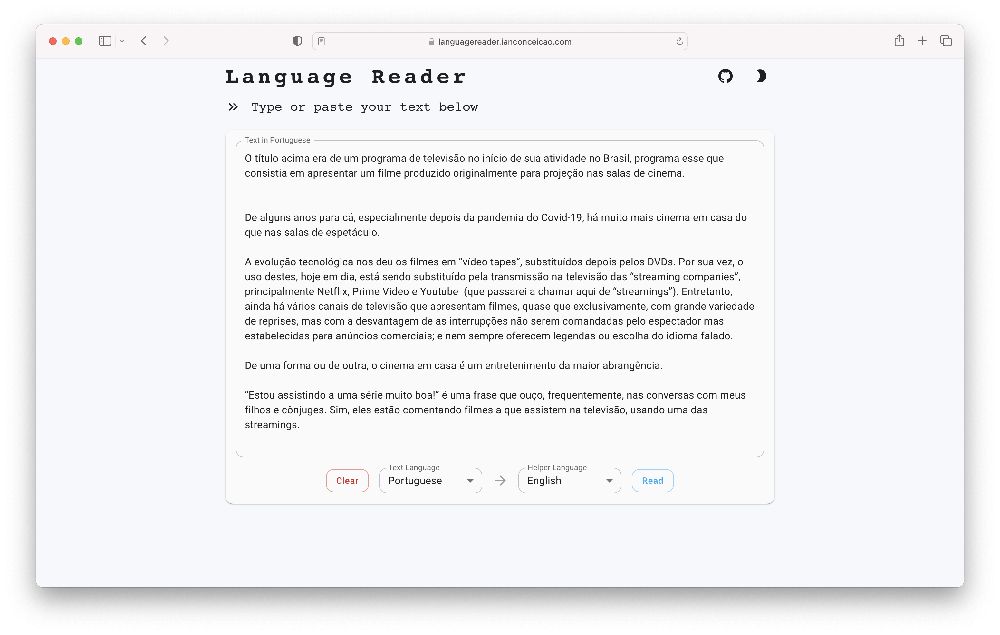
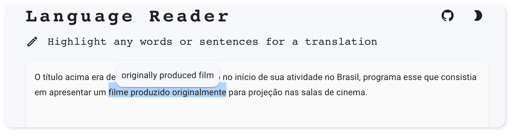
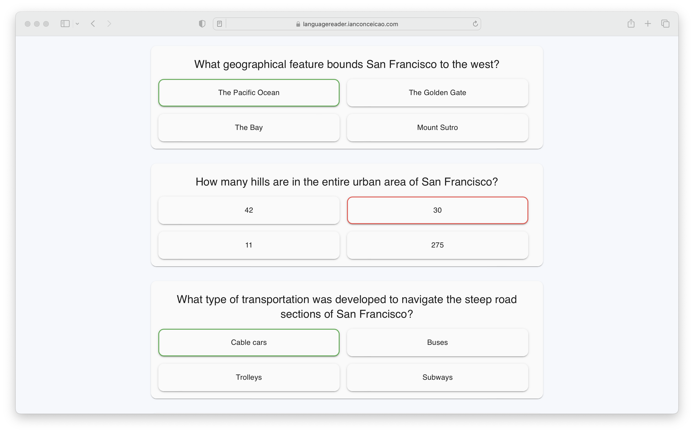

 
<a href="https://languagereader.ianconceicao.com">

 
 

</a>
<a href="https://languagereader.ianconceicao.com">languagereader.ianconceicao.com</a>

check it out ☝️&nbsp; 

## Motivation

Language Reader is a platform to help people learn a language by reading. Often, when reading a piece of text in a not-so-familiar language the reader may know 90% of the words or phrases, but misses a crucial 10%. This site aims to bridge that gap, by letting someone read a text and offer help when needed. It also lets readers test their comprehension at the end by automatically generating a quiz based on the text.

## Tutorial

### 📁 Paste in any text in any language to the textbox and set the helper language

Simply paste in your text and provide a 'helper' language. The helper language is meant to be your native language. It is the language which text will be translated to if you need the help, and the language the quiz will be in. Click 'read' when ready.

### ✍️ Highlight words or phrases for automatic translation

### ❓ Take a quiz and test your knowledge of the text

## 🚧 🏗️ Features

This site is a work in progress, there is still much more to come. 

- ✅ Highlight any piece of text to translate it
- ✅ Automatically create a multiple choice quiz based on the text
- ✅ Support most common languages
- ✅ Dark Mode
- 🔲 Support every language (that google translate offers)
- 🔲 Provide some default texts for the user to demo the site with
- 🔲 Text to speech for word and sentence pronounciation
- 🔲 Support other input types, like scanning a book
- 🔲 Mobile Friendly

## Tech Stack

- **Fronted:** Nextjs + React.js + Material UI
- **Server:** Firebase
- **Langauge API:** Google Cloud Translate
- **Quiz API:** GPT 3.5 Turbo
- **Continuous Deployment:** Netlify for Nextjs, Github Actions for Firebase
